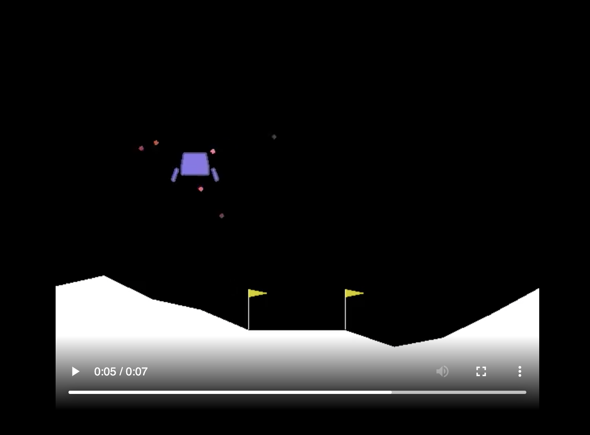

# LunarLanderII

## 0. Basic Information

- Name: Lunar Lander II, OpenAI Gym Reinforcement Learning Project
- Author: Yutian Wang
- Date: April 2021
- Version: v1.0

## 1. Introduction

This is a project aiming to solve the [Lunar Lander v2](https://gym.openai.com/envs/LunarLander-v2/) reinforcement Learning problem privided by OpenGym AI. 

In the Lunar Lander V2 environment, we aim to automate the landing process of a lunar lander. The lander has three boasters: a main boaster which fires downward to slow the landing, and two "side boasters" (one on left and one on right) that help adjust the position of the lander. The whole simulation is 2-dimensional. 

The lunar land, as the real Moon surface, is not flat and has different and different shapes. The shape of the lunar surface differs in each round. The surface is visible to the player or the lander. There are two flags on the lunar surface, and our aim is let the lander land within the area between these two flags. The landing fails either if the lander land outside of the area between the flags or crash. 

Below is a frame from the example [video](https://gym.openai.com/videos/2019-10-21--mqt8Qj1mwo/LunarLander-v2/original.mp4). 

More detailed information about the environment can be found [here](https://gym.openai.com/envs/LunarLander-v2/).

## 2. Algorithm

This project used the REINFORCE algorithm to train the automate lander and do reinforcement learning. REINFORCE is a policy gradient algorithm, and more specifically, in this case, at each time step, the lander can fire any of the three boasters. 

We want to train an algorithm that decide which engine(boaster) to fire up at each time step. We build a deep neural network to help make that decision and do the training. In each trail, we calculate the reward as specified in the environment description and compute the cost (see function [compute_expected_cost](https://github.com/yutianw00/LunarLanderII/blob/5bffe0315b831553073f91e8862a6466dcd09654/reinforce.py#L22)), and do back-tracking gradient descent on the neural network architecture we built and updates the weights accordingly. We kept training for 5000 trails for over 6 hours until the reward converges. 

## 3. Result

We run our trained automated lander for another 100 times and it landed successfully for 94 times. So it reached an successful rate of 94%. 

## 4. Files in this repository

- README.md: this file. 
- reinforce.py: Python model building and training file.
- mypolicy.pth: the file contains the trained weights for the neural network. 
- lunarlander2.png: a picture used in this file for illustration purpose.

## 5. About and Acknowledgement

This project is a project homework in 10-701 Introducion to Machine Learning in Carnegie Mellon University. Special thanks to the Professors and TAs for teaching this course, designing this assignment, providing the starter code and debuggging help. 
